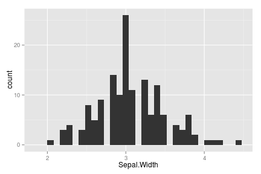
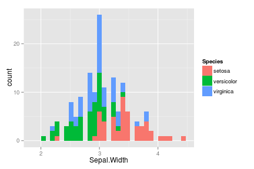
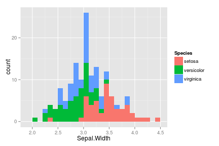
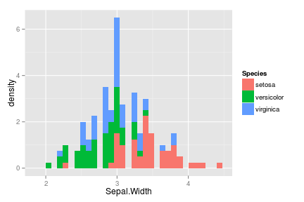
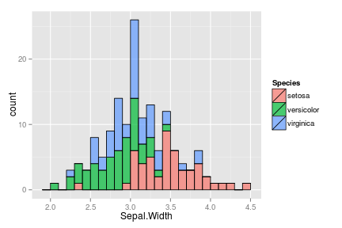
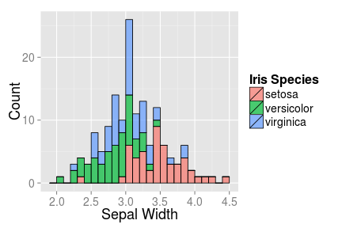

---
html_document:
  toc: true
  number_sections: true
  highlight: haddock
  css: bertplot_styles.css
title: "Basic Histograms in ggplot2"
output: 
  html_document: 
    keep_md: yes
---


# Basic Syntax
[code lang='r']
library(ggplot2)[/code]
[code lang='r']
ggplot(iris,aes(Sepal.Width))+geom_histogram()[/code]

```
stat_bin: binwidth defaulted to range/30. Use 'binwidth = x' to adjust this.
```

<div class="rimage center"></div>

<a href="#top">Back to top</a>

# Additional Features

## Add Groups

[code lang='r']
ggplot(iris,aes(Sepal.Width,fill=Species))+geom_histogram()[/code]

```
stat_bin: binwidth defaulted to range/30. Use 'binwidth = x' to adjust this.
```

<div class="rimage center"></div>

## Fix Binwidth

[code lang='r']
ggplot(iris,aes(Sepal.Width,fill=Species))+geom_histogram(binwidth=.10)[/code]
<div class="rimage center"></div>

## As a Density

[code lang='r']
ggplot(iris,
       aes(Sepal.Width,fill=Species))+geom_histogram(aes(y=..density..))[/code]

```
stat_bin: binwidth defaulted to range/30. Use 'binwidth = x' to adjust this.
```

<div class="rimage center"></div>

<a href="#top">Back to top</a>
 
# Aesthetics

## Add Outlines to Bars

[code lang='r']
ggplot(iris,aes(Sepal.Width,fill=Species))+
  geom_histogram(binwidth=.1,    # Fixed Bin-width
                 alpha=0.7,      # Make Slightly transparent
                 color='black',  # Add Outline
                 size=0.4)       # Thickness of Outline[/code]
<div class="rimage center"></div>

## Modify Axes

[code lang='r']
ggplot(iris,aes(Sepal.Width,fill=Species))+
  geom_histogram(binwidth=.1,alpha=0.7,color='black',size=0.4) +
  scale_x_continuous('Sepal Width')+          # Add label to x-axis
  scale_y_continuous('Count')+                # Add label to y-axis
  scale_fill_discrete('Iris Species')+        # Add label to legend
  theme(axis.text.x=element_text(size=14),    # Change x-axis value text-size
        axis.title.x=element_text(size=18),   # Change x-axis label text-size
        axis.text.y=element_text(size=14),    # Change y-axis value text-size
        axis.title.y=element_text(size=18),   # Change y-axis label text-size
        legend.text=element_text(size=14),    # Change legend value text-size
        legend.title=element_text(size=16))   # Change legend title text-size[/code]
<div class="rimage center"></div>

<a href="#top">Back to top</a>

